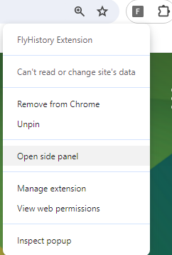
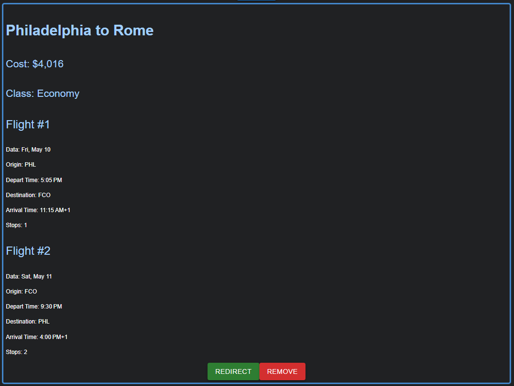

# FlyHistory

CIS 3500 Final Project

FlyHistory is a Chrome Extension designed to streamline the process of tracking flights that users are interested in. With FlyHistory, users can effortlessly keep tabs on flights they've viewed on Google Flights, making it easy to reference and manage their travel plans. On each Google Flights page users view, FlyHistory will automatically detect and record the flight into its list. To access flight history, click on the FlyHistory icon in the Chrome browser toolbar. Users can manage, filter, and reference their tracked flights directly within the FlyHistory interface.

Landing Page: https://melaniechen912.github.io/flyhistory_page/
Video Demo: https://www.youtube.com/watch?v=7OOMaprtZOk

## Features
1. Automatic Tracking: FlyHistory automatically records flights that users view, eliminating the need for manual input or data entry.
2. History Management: Users can easily access and manage their flight history directly within the extension interface.
3. Flight Details: FlyHistory provides detailed information about tracked flights, including departure and arrival times, airlines, and more.
4. Customization: Users can customize their tracking preferences and settings to suit their individual needs and preferences.
5. User-Friendly Interface: FlyHistory offers an intuitive and user-friendly interface, making it simple for users to navigate and utilize the extension.

## Screenshots
The first screenshot showcases how to open up the side panel for FlyHistory:

The second screenshot shows an example of the flight information that is stored:

## How to Use
1. Clone repository and install all necessary node dependencies via npm install.
2. Run npm run build.
3. Add extension to your Chrome browser's extension library.
4. Click the puzzle piece at the top bar of your browser that leads to the extension library.
5. Then navigate to Google Flights and start searching for flights! The flight information will be stored when you navigate to a **booking** page.
6. From the list of installed extensions, select the three dots right of the FlyHistory extension and click Open Side Panel. Here, you will see all your stored flights and apply filters as needed. Click the redirect button to navigate back to the page.

## Our Team
Developed by Brady, Noah, Jason, Melanie
